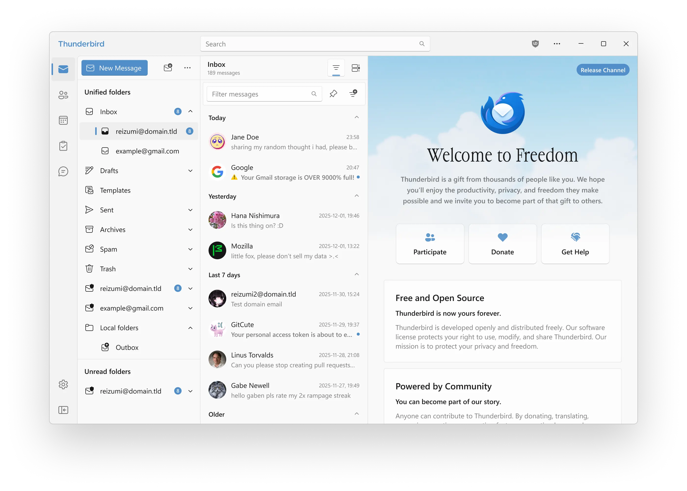

<p align="center"></p>

<p align="center">An elegant Thunderbird theme with frosted-glass UI, system accent colours, and a custom wallpaper background.</p>

<p align="center"></p>

> **Fork of [reizumii/lightbird](https://github.com/reizumii/lightbird)** with additional fixes: dark/light mode improvements, neutral dark palette, opaque dialogs, patched Conversations and Auto Profile Picture addons.

## Installation

### Linux / macOS

```bash
git clone https://github.com/MaxGiuP/lightbird
cd lightbird
bash install.sh
```

### Windows

Download the repo as a ZIP or clone it, then open PowerShell in the folder and run:

```powershell
powershell -ExecutionPolicy Bypass -File install.ps1
```

> **Close Thunderbird before running the installer** — Windows locks XPI extension files while Thunderbird is open and the installer won't be able to update them.

Both installers auto-detect your Thunderbird profile, copy the theme files into `chrome/`, install patched extensions, and merge the required preferences into `user.js`. Restart Thunderbird after running.

### Manual install

1. In Thunderbird, open **Menu → Help → Troubleshooting Information**.
2. Click **Open Folder** next to *Profile Folder*.
3. Inside the profile folder, create a `chrome/` directory if it does not exist.
4. Copy these items from this repo into `chrome/`:
   - `userChrome.css`
   - `userContent.css`
   - `lightbird/` (whole directory)
   - `images/` (whole directory)
5. Copy `user.js` into the **profile root** (the folder containing `chrome/`, not inside it).
6. Copy the XPI files from `extensions/` into the profile's `extensions/` folder.
7. Restart Thunderbird.

### Uninstall

**Linux / macOS:**
```bash
bash install.sh --uninstall
```

**Windows:**
```powershell
powershell -ExecutionPolicy Bypass -File install.ps1 -Uninstall
```

---

## Recommended add-ons

The patched versions of these are included in `extensions/` and installed automatically:

- [Thunderbird Conversations](https://addons.thunderbird.net/thunderbird/addon/gmail-conversation-view/) — threaded conversation view (patched: dark mode toggle always visible)
- [Auto Profile Picture](https://addons.thunderbird.net/thunderbird/addon/auto-profile-picture/) — avatar images in message list (patched: refreshes immediately on thread expand/collapse)

Also recommended:
- [uBlock Origin](https://addons.thunderbird.net/thunderbird/addon/ublock-origin/) — optional ad blocking

## Windows — Mica / Acrylic transparency

Thunderbird 140+ supports native Mica/Acrylic transparency on Windows 11.
Open **Advanced Preferences** and set:

| Preference | Value |
|---|---|
| `widget.windows.mica` | `true` |
| `widget.windows.mica.toplevel-backdrop` | `1` = Mica, `2` = Acrylic |

Also set Thunderbird's colour theme to **System theme — auto**.

## Customization

### CSS variables

All sizing and colour tokens live in `lightbird/components/variables.css`.
Create a `lightbird/custom.css` to override them without touching the base files:

```css
/* lightbird/custom.css — example: red accent */
:root {
  --selected-item-color: rgba(255, 0, 0, 0.1) !important;
  --lb-text-color: rgba(255, 0, 0) !important;
  --lb-panel-bgcolor: rgba(255, 0, 0, 0.05) !important;
}
```

Then add one line to `userChrome.css`:

```css
@import "lightbird/custom.css";
```

### Wallpaper

Replace `images/winmail.png` with any image you prefer and re-run the installer.

### Hide the Lightbird logo

In Thunderbird **Advanced Preferences**, create a Boolean preference:

```
lightbird.logo.hide = true
```

---

## Acknowledgements

Fork of [reizumii/lightbird](https://github.com/reizumii/lightbird).

Icons: [Microsoft Fluent UI System Icons](https://github.com/microsoft/fluentui-system-icons)
Bird + mail icon: derivative of [Microsoft Fluent Emoji](https://github.com/microsoft/fluentui-emoji)
Font: [Junicode](https://github.com/psb1558/Junicode-font)
Cloud photo: [engin akyurt](https://unsplash.com/@enginakyurt) on Unsplash
